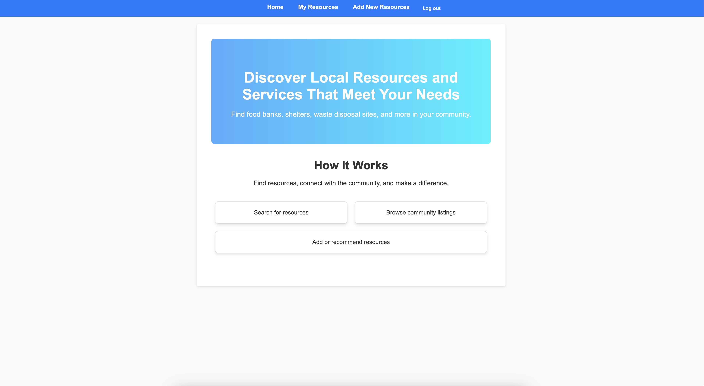

# Community Resource Hub

## Getting Started
- **Website**: Visit the live site [here](https://community-resource-hub-2b405874d7f6.herokuapp.com/).
- **Planning Materials**: See the project roadmap on [Trello](https://trello.com/b/y9RWQm11/local-community-resource-app).

## Description

Community Resource Hub is a web application that allows users to search for and save local resources, such as food banks, shelters, clothing donations, and waste disposal facilities. Users can contribute resources with relevant details like phone number, address, and type to help others access valuable services within their communities.

## Features

### User Registration and Authentication
- **Sign Up**: New users can create accounts to manage resources they contribute.
- **Log In**: Registered users can securely log in to access and manage their contributions.
- **Log Out**: Users can log out to ensure the security of their accounts.

### Resource Browsing and Viewing
- **Browse Resources**: Users and guests can view a list of available community resources, organized by type (e.g., food, shelter).
- **View Resource Details**: Each resource includes essential information, such as location, category, and contact information.
- **Filter Resources**: Users can filter resources by category (e.g., food banks, shelters) to quickly find relevant information.

### Adding and Managing Resources
- **Add Resource**: Authenticated users can contribute new resources, including details like the name, description, location, and contact information.
- **Categorize Resource**: Users can select a category for each resource to ensure ease of discovery for others.
- **Edit Resource**: Users can update details of resources they’ve contributed to keep information accurate and helpful.
- **Delete Resource**: Users can remove resources they’ve added if they are outdated or no longer relevant.

### User Profile Management
- **View Profile**: Users can view their profile, which includes a list of all resources they’ve contributed.
- **Manage Contributions**: The profile page makes it easy for users to edit or delete their resources.

## Usage

### Signing Up
1. Navigate to the signup page.
2. Enter your username and password to create an account.
3. Log in to start adding and managing your local community resources.

### Browsing Resources
1. View the list of available resources directly on the homepage.
2. Use the search and filter options to locate resources by ZIP code or category (e.g., food, shelter).
3. Click on a resource to see detailed information about it, including location and contact info.

### Adding a New Resource
1. Go to "Add Resource" in the navigation bar.
2. Enter the resource details, including name, category, description, location, and contact information.
3. Submit to add the resource to your resource lsit.

### Managing Resources
- **Editing**: Go to your profile, select a resource you've added, and update its details.
- **Deleting**: On your profile, select a resource and click delete to remove it from the hub.

## Technologies Used
- **Backend**: Django, Python
- **Frontend**: Django Templates, CSS
- **Database**: PostgreSQL
- **Authentication**: Django's built-in user authentication system

## Future Plans
- **Map Integration**: Integrate a map feature to display resources geographically.
