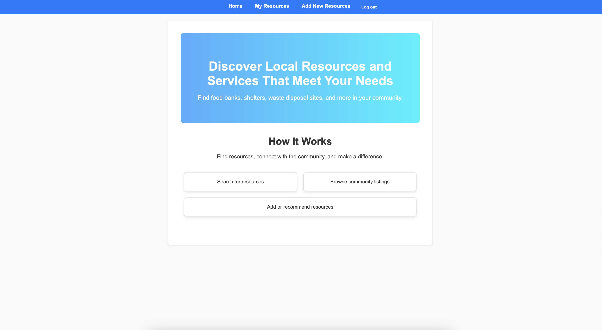

# Active Vibe

## Getting Started
- To visit the website click [here](https://active-vibe.netlify.app/)
- To view the full planning materials visit our [Trello Board](https://trello.com/b/A0sJcLBB/fitness-tracker)
- To view the backend repo please click [here](https://github.com/andrewreese16/fitness-tracker-backend)
## Description

The Active Vibe App is a web-based application designed to help users track their workouts and set fitness goals. The app allows users to create accounts, log workouts, set goals, and monitor their progress over time. Users can log in to view, edit, or delete workouts and goals to stay on top of their fitness journey.

## Features

### User Authentication
- **Sign Up**: New users can create an account to start tracking workouts and goals.
- **Log In**: Returning users can log into their accounts to access previously stored workout and goal data.
- **Log Out**: Users can securely log out of their account when finished.

### Workout Logging
- **Log a New Workout**: Users can log a new workout with details like:
  - Workout type (e.g., cardio, strength training)
  - Date
  - Calories burned
  - Notes
- **View Logged Workouts**: Users can view a list of all workouts they’ve logged over time.
- **Edit a Workout**: Users can edit any workout entry to update details or add notes about the session.
- **Delete a Workout**: Users can delete any workout entry in case of errors or if they no longer want to keep it.

### Goal Setting and Tracking
- **Set Fitness Goals**: Users can set specific fitness goals such as weight loss, strength gain, or improving endurance. 
  - Target completion date.
- **Search and Filter**: Users can easily search and filter workouts or goals quickly find relevant entries.

### User-Friendly Interface
- The app provides a clean, intuitive interface that makes it easy to log workouts and goals.
- Navigation is simple, with clear pathways to add, edit, view, or delete information.

## Usage

### Signing up 
1. Visit the signup page.
2. Enter your details (username, password).
3. Once signed up, log in to start tracking your workouts and goals. 

### Logging Workouts
1. Click "New Workout" on the Navbar.
2. Fill in the workout type, date, and calories burned.
3. Save the workout entry to track your fitness activities.

### Managing Workouts
- View all your logged workouts on the workouts page.
- Edit or delete any workout by clicking the respective buttons next to each workout entry.

### Setting Goals 
1. Navigate to the workout details page.
2. Fill in the details of your goal including goal type, and finish date.
3. Save your goal and click the complete button when completed.

## Technologies Used
- Node.js: Backend framework 
- Express.js: Web server
- MongoDB & Mongoose: Database
- React: Frontend framework 
- JWT: User authenication 

## Future Plans
- Develop this into a mobile app
- Add workout tracking charts

## Contributors GitHub
- [Andrew Reese](https://github.com/andrewreese16)
- [Robbie Lumpkin](https://github.com/Onlypros)
- [Devin Garcia](https://github.com/Devin-Elhefe)